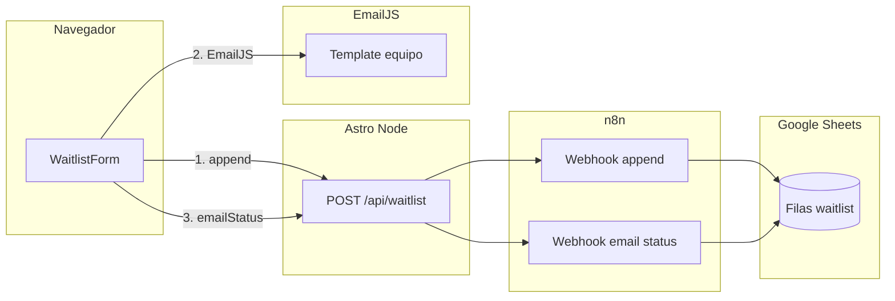

# Infraestructura y despliegue (Snowbound)

Documento de referencia para **cómo está montada la app**, **variables de entorno**, **Docker** y **qué hacer al desplegar** (local, contenedor o VPS). Los detalles concretos de los workflows n8n y la hoja de Google siguen en [`n8n.md`](./n8n.md).

## Arquitectura (resumen)



1. El formulario llama primero a **`/api/waitlist`** con `step: "append"` → el servidor reenvía a n8n → fila nueva en Sheets (`emailSent` pendiente).
2. En el navegador, **EmailJS** envía el correo al template configurado (p. ej. aviso al equipo).
3. El formulario vuelve a llamar a **`/api/waitlist`** con `step: "emailStatus"` para actualizar la columna **`emailSent`** en Sheets.

Los webhooks de n8n validan el header **`X-Waitlist-Secret`**; debe coincidir con **`WAITLIST_N8N_SECRET`** en Astro y en el contenedor n8n.

## Stack técnico

| Pieza | Detalle |
|--------|---------|
| Framework | [Astro](https://astro.build/) 6.x |
| Runtime producción | [Adapter Node](https://docs.astro.build/en/guides/integrations-guide/node/) en modo **`standalone`** → `node ./dist/server/entry.mjs` |
| Imagen Docker | Multi-stage: **Node 22** (bookworm-slim), build + imagen final mínima |
| Automatización opcional | **n8n** (`docker-compose.n8n.yml`), datos en **`./n8n_data`** |

## Construcción de la imagen web (`Dockerfile`)

- **Stage `builder`**: copia dependencias, `npm ci`, copia el repo, **`npm run build`** (Astro).
- **Stage `runner`**: solo `dist/`, `node_modules/` y `package.json`; **`CMD`** ejecuta el servidor Node en **`PORT`** (por defecto **4321**).

**Importante:** las variables **`PUBLIC_*`** de EmailJS deben existir **en el momento del build** del cliente Astro (se inyectan en el bundle). En Docker se pasan como **`ARG`/`ENV`** en el stage builder (ver tabla abajo). Las variables **solo servidor** (n8n, secretos) **no** van en el Dockerfile: se resuelven en **runtime** con `process.env` vía `env_file` / `environment` en Compose o el orquestador que uses.

El **`.dockerignore`** excluye entre otras cosas `node_modules`, `dist`, `.env` y `*.md`; el contenedor **no** incluye tu `.env` — debes inyectar runtime env en el despliegue.

## Servicios Docker en el repo

| Archivo | Servicio | Rol |
|---------|----------|-----|
| [`docker-compose.yml`](../docker-compose.yml) | `web` | Sitio Astro en el puerto **4321** |
| [`docker-compose.n8n.yml`](../docker-compose.n8n.yml) | `n8n` | UI **5678**, volumen **`./n8n_data` → `/home/node/.n8n`** |

En **Docker Desktop (Windows/macOS)**, el servicio `web` usa por defecto **`host.docker.internal`** para alcanzar n8n en el host. En **Linux** puro puede hacer falta **`extra_hosts`** o poner web y n8n en la misma red Compose; véase [`n8n.md`](./n8n.md) (misma máquina / proxy).

## Variables de entorno

### Cliente (build time) — prefijo `PUBLIC_`

Definidas en **`.env`** para `npm run dev` / `npm run build` local, y como **build args** en `docker compose build` para la imagen `web`.

| Variable | Uso |
|----------|-----|
| `PUBLIC_EMAILJS_PUBLIC_KEY` | Inicialización de `@emailjs/browser` |
| `PUBLIC_EMAILJS_SERVICE_ID` | Servicio EmailJS |
| `PUBLIC_EMAILJS_TEMPLATE_ID` | Plantilla del correo enviado desde el navegador |

Plantilla: el formulario envía **`title`**, **`email`**, **`time`**. Autorespuestas al suscriptor se configuran en el panel de EmailJS si las necesitas.

### Servidor (runtime) — Astro `/api/waitlist`

Leídas con **`serverEnv()`** en [`src/pages/api/waitlist.ts`](../src/pages/api/waitlist.ts): primero **`process.env`**, luego `import.meta.env` (útil en desarrollo). En Docker, **`process.env`** debe llevar los valores en tiempo de ejecución (p. ej. `env_file: .env` + `environment` en Compose).

| Variable | Uso |
|----------|-----|
| `WAITLIST_N8N_SECRET` | Secreto compartido; header **`X-Waitlist-Secret`** hacia n8n |
| `N8N_APPEND_WEBHOOK_URL` | URL POST del workflow que **añade fila** |
| `N8N_EMAIL_STATUS_WEBHOOK_URL` | URL POST del workflow que **actualiza `emailSent`** |

En **`docker-compose.yml`**, `N8N_APPEND_WEBHOOK_URL` y `N8N_EMAIL_STATUS_WEBHOOK_URL` del servicio `web` se pueden **sobrescribir** con:

- `N8N_DOCKER_APPEND_WEBHOOK_URL`
- `N8N_DOCKER_EMAIL_STATUS_WEBHOOK_URL`

(así en `.env` puedes dejar `localhost` para `npm run dev` y URLs internas para el contenedor.)

### n8n (contenedor)

Ver [`docker-compose.n8n.yml`](../docker-compose.n8n.yml). Destacables:

| Variable | Uso |
|----------|-----|
| `WAITLIST_N8N_SECRET` | Mismo valor que en Snowbound |
| `WEBHOOK_URL` | Base pública de webhooks (ajustar en producción con dominio HTTPS) |
| `N8N_HOST`, `N8N_PROTOCOL`, `N8N_SECURE_COOKIE` | Seguridad y cookies; en HTTPS de producción revisar documentación n8n |
| `N8N_BLOCK_ENV_ACCESS_IN_NODE` | En este proyecto se desactiva para compatibilidad con nodos Code |

Plantilla de todas las variables del proyecto: **`.env.example`** (copiar a **`.env`**, nunca commitear secretos).

## Despliegue local (sin Docker web)

```bash
cp .env.example .env
# Editar .env: EmailJS, WAITLIST_N8N_SECRET, URLs de webhooks n8n
npm install
npm run dev
```

n8n en local: `npm run docker:n8n:up` o `docker compose -f docker-compose.n8n.yml up -d` (ver [`n8n.md`](./n8n.md)).

## Despliegue: app en Docker (n8n en el host)

1. `.env` con `PUBLIC_EMAILJS_*`, `WAITLIST_N8N_SECRET` y (para dev en host) URLs locales si aplica.
2. n8n en marcha en el host (puerto 5678).
3. Desde la raíz del repo:

   ```bash
   npm run docker:web:up
   ```

   Equivale a build con args desde `.env` y `docker compose up -d`. Rebuild tras cambios de front:

   ```bash
   npm run docker:web:build
   docker compose up -d web
   ```

## Despliegue en VPS / producción (checklist)

1. **Secretos:** generar un `WAITLIST_N8N_SECRET` fuerte; mismo valor en Astro y n8n.
2. **URLs de webhooks:** deben ser alcanzables **desde el servidor donde corre Astro** (no desde el navegador). Si Astro y n8n están en la misma red Docker, usar `http://n8n:5678/webhook/...` o el nombre de servicio que definas.
3. **EmailJS:** volver a pasar **`PUBLIC_*`** en el **build** de la imagen (CI/CD o `docker compose build --build-arg ...`).
4. **HTTPS:** proxy inverso (Caddy, Traefik, nginx) delante de Astro y, si aplica, de n8n; actualizar **`WEBHOOK_URL`** y variables `N8N_*` según la [documentación n8n](https://docs.n8n.io/hosting/configuration/environment-variables/).
5. **Migración n8n:** copiar el directorio **`n8n_data`** completo al servidor y montarlo igual (`./n8n_data:/home/node/.n8n`). Si usas **`N8N_ENCRYPTION_KEY`**, debe ser la misma que en el origen. Más detalle en [`n8n.md`](./n8n.md).

## Comandos útiles (referencia)

| Objetivo | Comando |
|----------|---------|
| Desarrollo | `npm run dev` |
| Build local | `npm run build` → `npm run preview` |
| n8n arriba / abajo | `npm run docker:n8n:up` / `npm run docker:n8n:down` |
| Web Docker | `npm run docker:web:up` / `npm run docker:web:down` |
| Solo rebuild imagen web | `npm run docker:web:build` |

## Más documentación

- **Workflows waitlist, Google Sheet, nodos Code:** [`n8n.md`](./n8n.md)
- **Código API waitlist:** [`src/pages/api/waitlist.ts`](../src/pages/api/waitlist.ts)
- **Formulario + EmailJS:** [`src/components/WaitlistForm.astro`](../src/components/WaitlistForm.astro)
